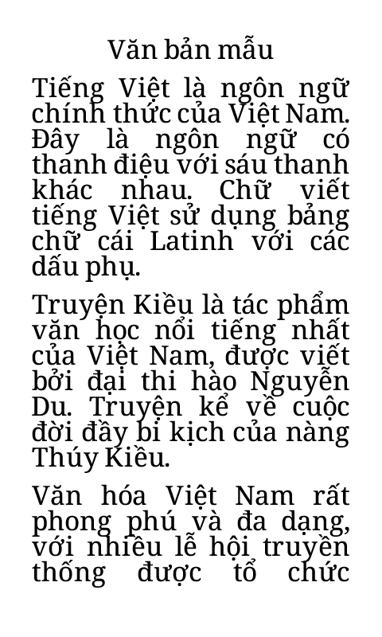
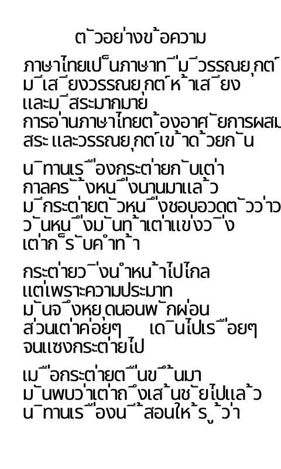

# Fonts

Papyrix Reader supports custom fonts for reading. Fonts are converted to a proprietary `.epdfont` format optimized for e-paper displays.

## How Fonts Work

### Streaming Font System

Custom fonts use a memory-efficient **streaming** system that loads glyph bitmaps on-demand from the SD card rather than keeping the entire font in RAM. This saves approximately **50KB of RAM per font**.

- **Glyph metadata** (character metrics, positions) is loaded into RAM
- **Glyph bitmaps** (the actual pixels) are streamed from SD as needed
- An **LRU cache** keeps recently-used glyphs in memory for fast access
- Typical RAM usage: ~25KB per font (vs ~70KB for fully-loaded fonts)

This is transparent to users - fonts work the same way, just more efficiently.

### Fallback Behavior

Papyrix ensures you can always read your books, even if a custom font fails:

1. **Font load failure** → Built-in font is used automatically
2. **Individual glyph failure** → Character is skipped gracefully (no crash)
3. **SD card read error** → Affected characters skipped, reading continues

If you notice missing characters, try switching to a different font in Settings. The built-in font is always available as a reliable fallback.

## Font Samples

### PT Serif

A versatile serif typeface with a contemporary feel. Excellent for body text with good readability on e-paper displays.

- **Styles**: Regular, Bold, Italic
- **License**: OFL (Open Font License)


### Bookerly

Amazon's custom font designed specifically for e-readers. Optimized for readability on low-resolution displays.

- **Styles**: Regular, Bold, Italic
- **License**: Proprietary (Amazon)


### Literata

A contemporary serif typeface designed for long-form reading. Features excellent legibility and a warm, inviting character.

- **Styles**: Regular, Italic (Variable font)
- **License**: OFL (Open Font License)


### Noto Serif

A classic serif font from Google's Noto family. Excellent readability with extensive language support.

- **Styles**: Regular, Italic
- **License**: OFL (Open Font License)


### Noto Sans

A clean sans-serif font from Google's Noto family. Modern appearance with wide language coverage.

- **Styles**: Regular, Italic (Variable font)
- **License**: OFL (Open Font License)


### Roboto

Google's signature font family. Clean, modern design ideal for UI and reading.

- **Styles**: Regular, Italic (Variable font)
- **License**: Apache 2.0


### Ubuntu

The Ubuntu font family has a contemporary style and is designed for screen reading. Warm and friendly character.

- **Styles**: Regular, Bold, Italic
- **License**: Ubuntu Font License


### OpenDyslexic

A typeface designed to increase readability for readers with dyslexia. Features weighted bottoms to prevent letter rotation.

- **Styles**: Regular, Bold, Italic
- **License**: OFL (Open Font License)


### Noto Serif Vietnamese

Noto Serif with full Vietnamese diacritic support for reading Vietnamese texts.

- **Styles**: Regular, Italic
- **Theme**: `light-vietnamese.theme`
- **License**: OFL (Open Font License)



### Noto Sans Thai

A sans-serif font with complete Thai script support.

- **Styles**: Regular
- **Theme**: `light-thai.theme`
- **License**: OFL (Open Font License)



### Noto Sans Arabic

A sans-serif font with complete Arabic script support including contextual shaping and ligatures.

- **Styles**: Regular, Bold
- **Theme**: `light-arabic.theme`
- **License**: OFL (Open Font License)

### CJK Fonts (Chinese/Japanese/Korean)

For CJK texts, Papyrix uses external `.bin` format fonts that are streamed from the SD card due to their large size.

- **Source Han Sans CN** (`source-han-sans-cn_20_20x20.bin`) - Simplified Chinese
- **King Hwa Old Song** (`king-hwa-old-song_38_33x39.bin`) - Traditional Chinese

See `light-cjk-external.theme` for usage.

## Converting Your Own Fonts

Use the `fontconvert.py` script to convert TTF/OTF fonts. Requires [uv](https://docs.astral.sh/uv/):

```bash
# Basic conversion
uv run scripts/fontconvert.py my-font -r MyFont-Regular.ttf -b MyFont-Bold.ttf -i MyFont-Italic.ttf --2bit -o /tmp/fonts/

# All reader sizes (14, 16, 18pt)
uv run scripts/fontconvert.py my-font -r MyFont-Regular.ttf --2bit --all-sizes -o /tmp/fonts/

# Thai font
uv run scripts/fontconvert.py noto-sans-thai -r NotoSansThai-Regular.ttf --2bit --thai --all-sizes -o /tmp/fonts/

# Arabic font
uv run scripts/fontconvert.py noto-sans-arabic -r NotoSansArabic-Regular.ttf -b NotoSansArabic-Bold.ttf --2bit --arabic --all-sizes -o /tmp/fonts/

# Generate C header (for builtin fonts)
uv run scripts/fontconvert.py my_font 16 MyFont-Regular.ttf --2bit > my_font_16_2b.h
```

### Options

- **-r, --regular** - Path to regular style font (required for binary mode)
- **-b, --bold** - Path to bold style font
- **-i, --italic** - Path to italic style font
- **-o, --output** - Output directory (default: current)
- **-s, --size-opt** - Font size in points (default: 16)
- **--all-sizes** - Generate 14pt, 16pt, and 18pt
- **--thai** - Include Thai script characters
- **--arabic** - Include Arabic script characters
- **--2bit** - 2-bit grayscale (smoother, larger)
- **--header** - Output C header instead of binary
- **--additional-intervals** - Add custom Unicode ranges

## Installing Fonts

1. Copy the font folder(s) to `/config/fonts/` on your SD card
2. Create or edit a `.theme` file in `/config/themes/`
3. Set the font references:

```ini
[fonts]
reader_font_small = my-font-14
reader_font_medium = my-font-16
reader_font_large = my-font-18
```

## Font Sources

- [Google Fonts](https://fonts.google.com/) - Free, open-source fonts
- [Noto Fonts](https://fonts.google.com/noto) - Extensive language coverage
