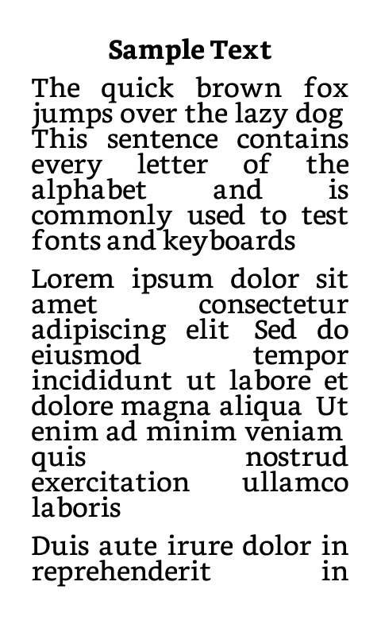
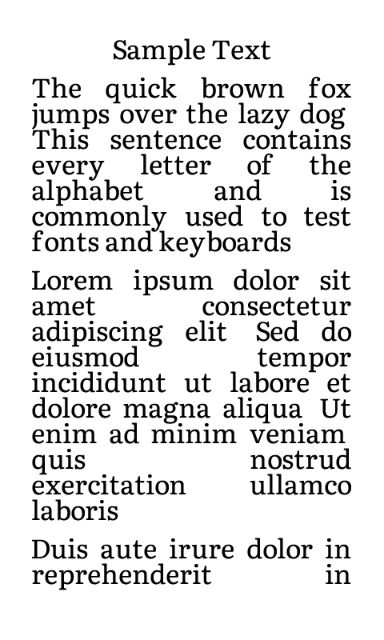
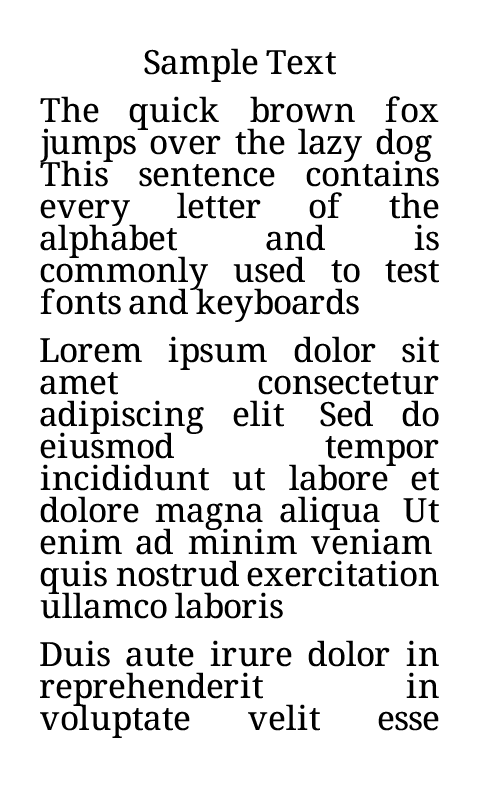
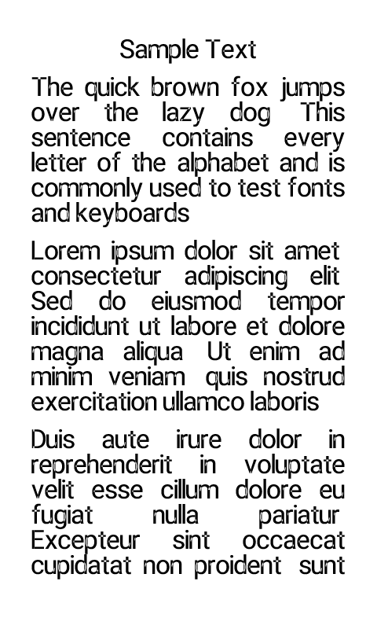
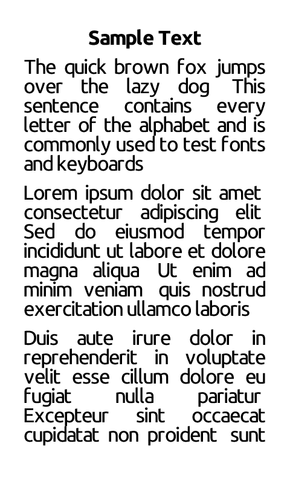
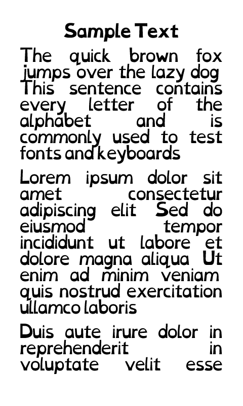

# Fonts

Papyrix Reader supports custom fonts for reading. Fonts are converted to a proprietary `.epdfont` format optimized for e-paper displays.

## How Fonts Work

### Streaming Font System

Custom fonts use a memory-efficient **streaming** system that loads glyph bitmaps on-demand from the SD card rather than keeping the entire font in RAM. This saves approximately **50KB of RAM per font**.

- **Glyph metadata** (character metrics, positions) is loaded into RAM
- **Glyph bitmaps** (the actual pixels) are streamed from SD as needed
- An **LRU cache** keeps recently-used glyphs in memory for fast access
- Typical RAM usage: ~25KB per font (vs ~70KB for fully-loaded fonts)

This is transparent to users - fonts work the same way, just more efficiently.

### Supported Styles

Custom `.epdfont` fonts support **regular** and **bold** styles:

- **Regular** (`regular.epdfont`) - Required. Loaded when the book is opened.
- **Bold** (`bold.epdfont`) - Optional. Loaded on demand when bold text is first encountered, saving ~42KB of RAM for books that don't use bold.
- **Italic** text renders using the regular variant. When using built-in fonts, the native italic is used.

### Fallback Behavior

Papyrix ensures you can always read your books, even if a custom font fails:

1. **Font load failure** → Built-in font is used automatically
2. **Individual glyph failure** → Character is skipped gracefully (no crash)
3. **SD card read error** → Affected characters skipped, reading continues

If you notice missing characters, try switching to a different font in Settings. The built-in font is always available as a reliable fallback.

### Built-in Font Coverage

The built-in fonts include native support for:

- **Latin** - Western and Eastern European languages, including Vietnamese diacritics
- **Cyrillic** - Russian, Ukrainian, and other Cyrillic-script languages
- **Thai** - Full Thai script with proper mark positioning
- **Greek** - Modern Greek alphabet
- **Arabic** - Arabic script with contextual shaping and RTL layout

No custom fonts are needed for these scripts - they work out of the box.

## Font Samples

### PT Serif

A versatile serif typeface with a contemporary feel. Excellent for body text with good readability on e-paper displays.

- **Styles**: Regular, Bold
- **License**: OFL (Open Font License)

### Bookerly

Amazon's custom font designed specifically for e-readers. Optimized for readability on low-resolution displays.

- **Styles**: Regular, Bold, Italic
- **License**: Proprietary (Amazon)

### Literata

A contemporary serif typeface designed for long-form reading. Features excellent legibility and a warm, inviting character.

- **Styles**: Regular, Bold, Italic
- **License**: OFL (Open Font License)

### Noto Serif

A classic serif font from Google's Noto family. Excellent readability with extensive language support.

- **Styles**: Regular
- **License**: OFL (Open Font License)

### Noto Sans

A clean sans-serif font from Google's Noto family. Modern appearance with wide language coverage.

- **Styles**: Regular, Italic (Variable font)
- **License**: OFL (Open Font License)

### Roboto

Google's signature font family. Clean, modern design ideal for UI and reading.

- **Styles**: Regular, Italic (Variable font)
- **License**: Apache 2.0

### Ubuntu

The Ubuntu font family has a contemporary style and is designed for screen reading. Warm and friendly character.

- **Styles**: Regular, Bold, Italic
- **License**: Ubuntu Font License

### OpenDyslexic

A typeface designed to increase readability for readers with dyslexia. Features weighted bottoms to prevent letter rotation.

- **Styles**: Regular, Bold, Italic
- **License**: OFL (Open Font License)

### Noto Sans Arabic

A sans-serif font with complete Arabic script support including contextual shaping and ligatures.

- **Styles**: Regular, Bold
- **Theme**: `light-arabic.theme`
- **License**: OFL (Open Font License)

### CJK Fonts (Chinese/Japanese/Korean)

For CJK texts, Papyrix uses external `.bin` format fonts that are streamed from the SD card due to their large size.

- **Source Han Sans CN** (`source-han-sans-cn_20_20x20.bin`) - Simplified Chinese
- **King Hwa Old Song** (`king-hwa-old-song_38_33x39.bin`) - Traditional Chinese

See `light-cjk-external.theme` for usage.

## Converting and Installing Fonts

See the [Customization Guide](customization.md#custom-fonts) for detailed instructions on converting TTF/OTF fonts to `.epdfont` format and installing them on your device.

## Font Sources

- [Google Fonts](https://fonts.google.com/) - Free, open-source fonts
- [Noto Fonts](https://fonts.google.com/noto) - Extensive language coverage
