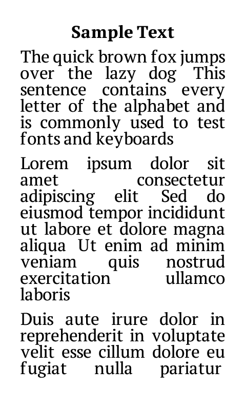
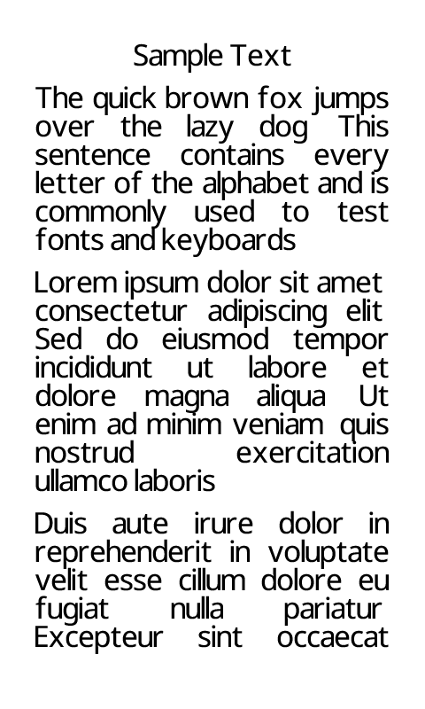

# Fonts

Papyrix Reader supports custom fonts for reading. Fonts are converted to a proprietary `.epdfont` format optimized for e-paper displays.

## Font Samples

### PT Serif

A versatile serif typeface with a contemporary feel. Excellent for body text with good readability on e-paper displays.

- **Styles**: Regular, Bold, Italic
- **License**: OFL (Open Font License)



### Bookerly

Amazon's custom font designed specifically for e-readers. Optimized for readability on low-resolution displays.

- **Styles**: Regular, Bold, Italic
- **License**: Proprietary (Amazon)


### Literata

A contemporary serif typeface designed for long-form reading. Features excellent legibility and a warm, inviting character.

- **Styles**: Regular, Italic (Variable font)
- **License**: OFL (Open Font License)


### Noto Serif

A classic serif font from Google's Noto family. Excellent readability with extensive language support.

- **Styles**: Regular, Italic
- **License**: OFL (Open Font License)


### Noto Sans

A clean sans-serif font from Google's Noto family. Modern appearance with wide language coverage.

- **Styles**: Regular, Italic (Variable font)
- **License**: OFL (Open Font License)



### Roboto

Google's signature font family. Clean, modern design ideal for UI and reading.

- **Styles**: Regular, Italic (Variable font)
- **License**: Apache 2.0


### Ubuntu

The Ubuntu font family has a contemporary style and is designed for screen reading. Warm and friendly character.

- **Styles**: Regular, Bold, Italic
- **License**: Ubuntu Font License


### OpenDyslexic

A typeface designed to increase readability for readers with dyslexia. Features weighted bottoms to prevent letter rotation.

- **Styles**: Regular, Bold, Italic
- **License**: OFL (Open Font License)


### Noto Serif Vietnamese

Noto Serif with full Vietnamese diacritic support for reading Vietnamese texts.

- **Styles**: Regular, Italic
- **Theme**: `light-vietnamese.theme`
- **License**: OFL (Open Font License)


### Noto Sans Thai

A sans-serif font with complete Thai script support.

- **Styles**: Regular
- **Theme**: `light-thai.theme`
- **License**: OFL (Open Font License)


### CJK Fonts (Chinese/Japanese/Korean)

For CJK texts, Papyrix uses external `.bin` format fonts that are streamed from the SD card due to their large size.

- **Source Han Sans CN** (`source-han-sans-cn_20_20x20.bin`) - Simplified Chinese
- **King Hwa Old Song** (`king-hwa-old-song_38_33x39.bin`) - Traditional Chinese

See `light-cjk-external.theme` for usage.

## Converting Your Own Fonts

Use the `convert-fonts.mjs` script to convert TTF/OTF fonts:

```bash
cd scripts && npm install  # First time only

# Basic conversion
node convert-fonts.mjs my-font -r MyFont-Regular.ttf -b MyFont-Bold.ttf -i MyFont-Italic.ttf

# All reader sizes (14, 16, 18pt)
node convert-fonts.mjs my-font -r MyFont-Regular.ttf --all-sizes

# Thai font
node convert-fonts.mjs noto-sans-thai -r NotoSansThai-Regular.ttf --thai --all-sizes

# Variable font with weight
node convert-fonts.mjs roboto -r Roboto-Variable.ttf --var wght=400 --all-sizes

# Generate HTML preview
node convert-fonts.mjs my-font -r MyFont-Regular.ttf --preview
```

### Options

| Option | Description |
|--------|-------------|
| `-r, --regular` | Path to regular style font (required) |
| `-b, --bold` | Path to bold style font |
| `-i, --italic` | Path to italic style font |
| `-o, --output` | Output directory (default: current) |
| `-s, --size` | Font size in points (default: 16) |
| `--all-sizes` | Generate 14pt, 16pt, and 18pt |
| `--thai` | Include Thai script characters |
| `--2bit` | 2-bit grayscale (smoother, larger) |
| `--var` | Variable font axis (e.g., `--var wght=400`) |
| `--preview` | Generate HTML preview |
| `--bin` | Binary format for CJK fonts |

## Installing Fonts

1. Copy the font folder(s) to `/config/fonts/` on your SD card
2. Create or edit a `.theme` file in `/config/themes/`
3. Set the font references:

```ini
[fonts]
reader_font_small = my-font-14
reader_font_medium = my-font-16
reader_font_large = my-font-18
```

## Font Sources

- [Google Fonts](https://fonts.google.com/) - Free, open-source fonts
- [Noto Fonts](https://fonts.google.com/noto) - Extensive language coverage
