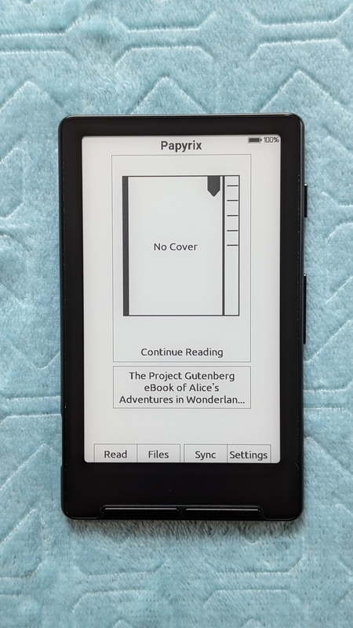
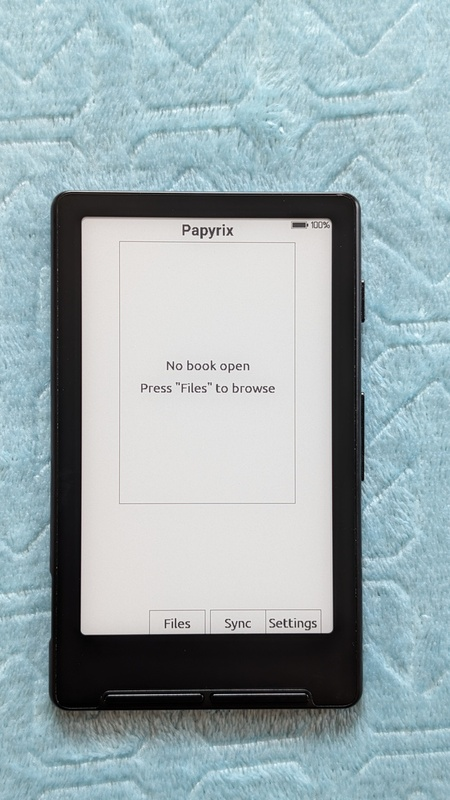
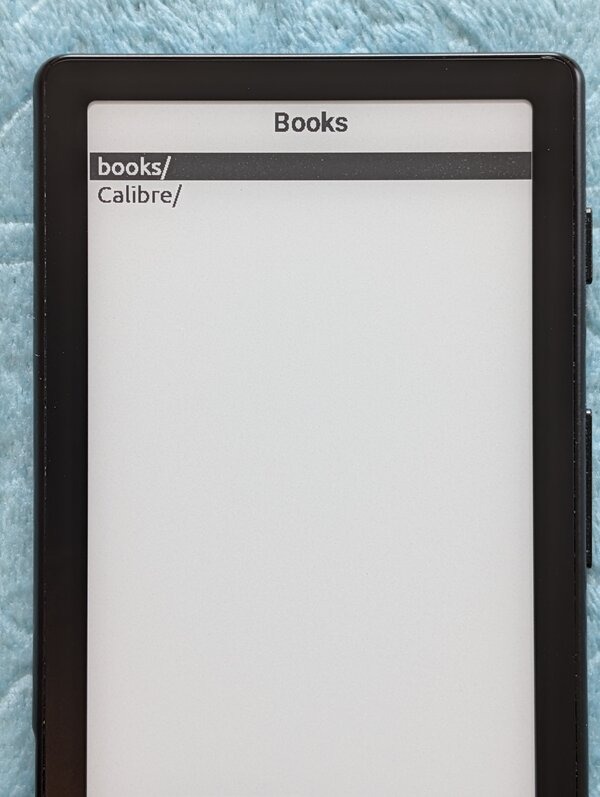
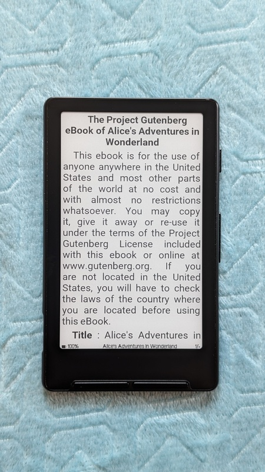
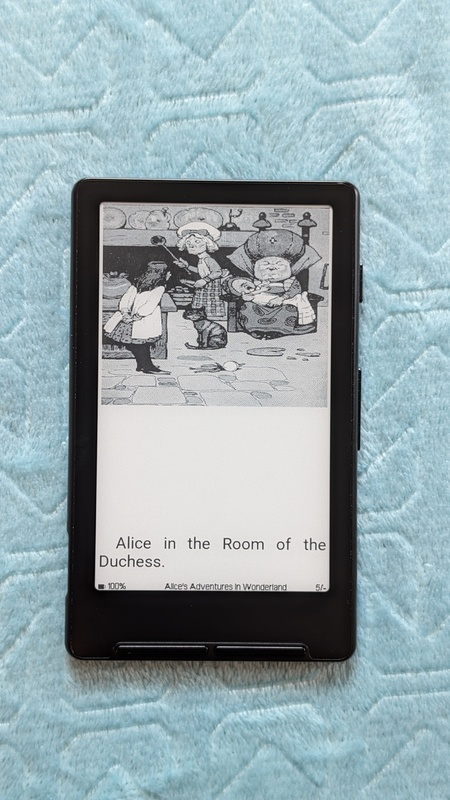
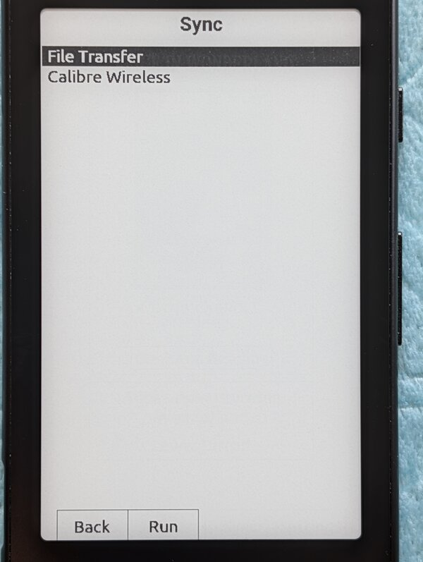
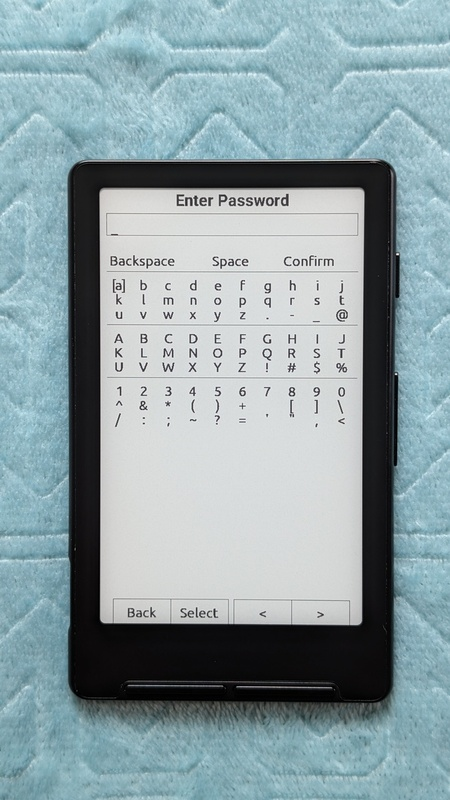
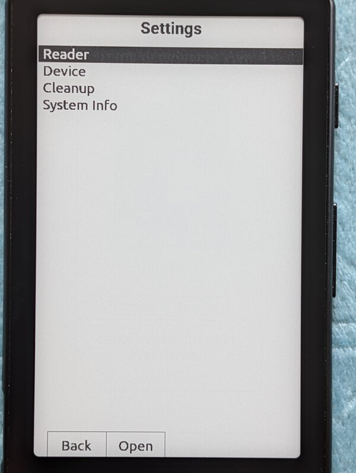

# Papyrix User Guide

Welcome to the **Papyrix** firmware. This guide outlines the hardware controls, navigation, and reading features of
the device.

## 1. Hardware Overview

The device utilises the standard buttons on the Xtink X4 in the same layout:

### Button Layout

- **Bottom Edge:** Back, Confirm, Left, Right
- **Right Side:** Power, Volume Up, Volume Down

---

## 2. Power & Startup

### Power On / Off

To turn the device on or off, **press and hold the Power button for half a second**. In **Settings** you can configure
the power button to trigger on a short press instead of a long one.

### First Launch

Upon turning the device on for the first time, you will be placed on the **Home** screen.

> **Note:** On subsequent restarts, the firmware will automatically reopen the last book you were reading (configurable via **Startup Behavior** in Settings).

---

## 3. Screens

### 3.1 Home Screen

With cover:


Without cover:



Empty:




The Home Screen displays the app title "Papyrix Reader" at the top with a **battery indicator** in the top-right corner.

#### Book Card
The center of the screen features a **book card** - a dark rectangle with a bookmark icon at the top:
- **With a book open:** Displays the book title, author, and "Continue Reading" text
- **No book open:** Displays "No book open"

Press **Confirm** on the book card to continue reading your current book.

#### Menu Items
Below the book card are two bordered menu items:
- **Files** — Browse and select books from the SD card
- **Settings** — Device settings and file transfer

**Navigation:**
* Use **Left/Right** or **Volume Up/Down** to move between items
* Press **Confirm** to select an item

### 3.2 Book Selection (Files)



The Files screen acts as a folder and file browser.

* **Navigate List:** Use **Left** (or **Volume Up**), or **Right** (or **Volume Down**) to move the selection cursor up
  and down through folders and books.
* **Open Selection:** Press **Confirm** to open a folder or read a selected book.
* **Delete Item:** Press the **Right** button to delete the selected file or folder. A confirmation dialog will appear;
  select **Yes** to confirm deletion or **No** to cancel.

> **Note:** EPUB (.epub), XTC (.xtc, .xtch), Markdown (.md, .markdown), and plain text (.txt, .text) file formats are supported. EPUB 2 and EPUB 3 formats are fully supported. Markdown files render with basic formatting (headers, bold, italic, lists). The device supports both FAT32 and exFAT formatted SD cards.

> **Note:** The following folders are automatically hidden from the file browser:
> - `System Volume Information`, `LOST.DIR`, `$RECYCLE.BIN` — OS system folders
> - `config` — Papyrix configuration files
> - `XTCache` — XTC format cache
> - `sleep` — Custom sleep screen images
> - `.papyrix` — Internal cache (dot-prefix hidden by default)

> **Note:** Each folder can display up to 1000 items. Organize large libraries into subfolders if you exceed this limit.

> **Note:** You cannot delete the currently open book. Close the book first before deleting it.

### 3.3 Reading Screen

Test:



Images:



See [4. Reading Mode](#4-reading-mode) below for more information.

### 3.4 File Transfer (Sync)



File transfer is accessible from the Home screen by pressing the **Left** button (or from the file browser, select **Sync**). This allows you to upload new e-books to the device over WiFi or connect to Calibre.

When you enter the screen, you'll be prompted to choose a network mode:

* **Join Network:** Connect to an existing WiFi network. You'll see a list of available networks and can enter passwords as needed. Previously saved networks will connect automatically.
* **Create Hotspot:** The X4 creates its own WiFi network that you can connect to directly from your computer or phone.



Once connected, your X4 will start hosting a web server. See the [webserver docs](webserver.md) for more
information on how to connect and upload files.

> **Note:** When you exit File Transfer, the device will automatically restart to reclaim memory used by WiFi.

### 3.5 Settings



The Settings screen is organized into four categories:

#### Reader

Reading and display settings:

- **Theme** (default: light)
  - Select from available themes (light, dark, or custom themes from SD card)
  - Themes control colors, layout, and fonts
  - See [Customization Guide](customization.md) for creating custom themes

- **Font Size** (default: Small)
  - Options: XSmall (12pt), Small (14pt), Normal (16pt), Large (18pt)
  - Text size for reading

- **Text Layout** (default: Standard)
  - Options: Compact, Standard, Large
  - Controls first-line indentation and paragraph spacing:
    - **Compact:** No indent, no extra spacing (dense text)
    - **Standard:** Normal indent (em-space), small spacing between paragraphs
    - **Large:** Large indent, full line spacing between paragraphs

- **Line Spacing** (default: Normal)
  - Options: Compact, Normal, Relaxed, Large
  - Controls vertical spacing between lines within paragraphs:
    - **Compact:** Tighter line spacing (0.85×)
    - **Normal:** Standard line spacing (0.95×)
    - **Relaxed:** More space between lines (1.10×)
    - **Large:** Maximum line spacing (1.20×)
  - Adjusting line spacing can improve readability for different fonts and preferences

- **Text Anti-Aliasing** (default: OFF)
  - Enable grayscale text rendering for smoother font edges on builtin fonts
  - Has no effect when using custom fonts loaded from SD card
  - Disable for faster page turns and to eliminate the brief "thick text" flash during transitions

- **Paragraph Alignment** (default: Justified)
  - Options: Justified, Left, Center, Right
  - Text alignment for paragraphs (headers remain centered)

- **Hyphenation** (default: ON)
  - Break long words at soft hyphen positions embedded in EPUB content
  - Words too wide for the line are automatically split with character-level hyphenation
  - Reduces large gaps in justified text and prevents words from overflowing

- **Show Images** (default: ON)
  - Display inline images within EPUB content and book covers
  - Disable for faster page rendering (images show "[Image]" placeholder)

- **Status Bar** (default: Full)
  - Options: None, No Progress, Full
  - Controls the reading screen status bar display
  - **Full:** Shows battery, book title, and page number (e.g., "5 / 12")
  - **No Progress:** Shows battery and book title only
  - **None:** Hides the status bar entirely for maximum reading area
  - **Note:** The total page count for a chapter appears only after the chapter is fully cached. While reading through a chapter for the first time, only the current page number is shown until all pages have been rendered. Overall book completion percentage is not available due to memory constraints on the device.

- **Reading Orientation** (default: Portrait)
  - Options: Portrait, Landscape CW, Inverted, Landscape CCW
  - Screen orientation for reading

#### Device

Power and device behavior settings:

- **Auto Sleep Timeout** (default: 10 min)
  - Options: 5 min, 10 min, 15 min, 30 min, Never
  - Time of inactivity before the device automatically sleeps

- **Sleep Screen** (default: Dark)
  - Options: Dark, Light, Custom, Cover
  - Which image to display when the device sleeps

- **Startup Behavior** (default: Last Document)
  - Options: Last Document, Home
  - **Last Document:** Resume reading the last opened book on startup
  - **Home:** Always start at the Home screen

- **Short Power Button** (default: Ignore)
  - Options: Ignore, Sleep, Page Turn
  - **Ignore:** Short press does nothing (long press for sleep)
  - **Sleep:** Short press puts device to sleep
  - **Page Turn:** Short press turns to next page while reading (convenient for one-handed reading)

- **Pages Per Refresh** (default: 15)
  - Options: 1, 5, 10, 15, 30
  - Number of pages to turn before performing a full e-paper refresh (clears ghosting)

- **Sunlight Fading Fix** (default: OFF)
  - Powers down the display after each page refresh
  - Prevents screen fading in bright sunlight (UV exposure causes the SSD1677 driver IC to fade to white)
  - Adds ~100-200ms overhead per page turn
  - Recommended for white X4 devices used outdoors

- **Front Buttons** (default: B/C/L/R)
  - Options: B/C/L/R, L/R/B/C
  - **B/C/L/R:** Back, Confirm, Left, Right (default layout)
  - **L/R/B/C:** Left, Right, Back, Confirm (swapped layout)

- **Side Buttons** (default: Prev/Next)
  - Options: Prev/Next, Next/Prev
  - **Prev/Next:** Volume Up = previous page, Volume Down = next page
  - **Next/Prev:** Volume Up = next page, Volume Down = previous page

#### Cleanup

Maintenance actions for the device:

- **Clear Book Cache** — Delete all cached book data and reading progress
- **Clear Device Storage** — Erase internal flash storage (requires restart)
- **Factory Reset** — Erase ALL data (caches, settings, WiFi credentials, fonts) and restart device

#### System Info

View device information: firmware version, uptime, WiFi status, MAC address, free memory, internal disk usage, SD card usage

### 3.6 Calibre Wireless

Calibre Wireless allows you to send books directly from **Calibre** (the popular ebook management software) to your Papyrix Reader over WiFi. This is the fastest way to transfer books if you already use Calibre.

#### Prerequisites

- [Calibre](https://calibre-ebook.com/) installed on your computer
- Both devices on the same WiFi network

#### Connecting to Calibre

1. From the Home screen, press **Left** to access **Sync**, then select **Calibre Wireless**
2. Connect to your WiFi network (same as your computer)
3. The device will show its IP address and port (e.g., `192.168.1.42:9090`)
4. The screen displays "Waiting for Calibre..."

#### In Calibre Desktop

1. Click **Connect/Share** in the toolbar
2. Select **Start wireless device connection**
3. Calibre will automatically discover your Papyrix Reader
4. Your device appears as "Papyrix Reader" (or your custom name)

#### Sending Books

Once connected:
1. Right-click any book in Calibre
2. Select **Send to device > Send to main memory**
3. The book transfers wirelessly to your reader's `/Books/` folder

#### Bidirectional Sync

Calibre can also:
- **See your library** - View books already on your device
- **Delete books** - Remove books from the device remotely

#### Configuration

Customize settings via `/config/calibre.ini` on your SD card:

```ini
[Settings]
device_name = Papyrix Reader
password =
```

- **device_name**: How your device appears in Calibre
- **password**: Optional password (must match Calibre's wireless device password)

For detailed instructions, see the [Calibre Wireless Guide](calibre.md).

> **Note:** When you exit Calibre Wireless, the device will automatically restart to reclaim memory used by WiFi.

### 3.7 Sleep Screen


You can customize the sleep screen by placing custom images in specific locations on the SD card:

- **Single Image:** Place a file named `sleep.bmp` in the root directory.
- **Multiple Images:** Create a `sleep` directory in the root of the SD card and place any number of `.bmp` images
  inside. If images are found in this directory, they will take priority over the `sleep.bmp` file, and one will be
  randomly selected each time the device sleeps.

> [!NOTE]
> You'll need to set the **Sleep Screen** setting to **Custom** in order to use these images.

#### Image Parameters

- **Resolution:** 480 × 800 pixels (portrait mode)
- **Color depth:** 8-bit grayscale or 24-bit color
- **Format:** BMP, uncompressed (BI_RGB)
- **Display levels:** 4 grayscale (black, dark gray, light gray, white)

> [!TIP]
> - Use 8-bit grayscale for best results - it's widely supported by image editors
> - Larger images will be automatically scaled down while preserving aspect ratio
> - All color images are converted to 4-level grayscale on the e-ink display

> [!TIP]
> The **Cover** sleep screen option displays the cover of the currently open book when the device sleeps.

---

## 4. Reading Mode

Once you have opened a book, the button layout changes to facilitate reading.

### Page Turning

- **Previous Page:** Press **Left** or **Volume Up**
- **Next Page:** Press **Right** or **Volume Down**
- **Power Button:** When **Short Power Button** is set to **Page Turn** in Settings, pressing the power button also turns to the next page (convenient for one-handed reading)

### Chapter Navigation
* **Next Chapter:** Press and **hold** the **Right** (or **Volume Down**) button briefly, then release.
* **Previous Chapter:** Press and **hold** the **Left** (or **Volume Up**) button briefly, then release.

### System Navigation
* **Return to Home:** Press **Back** to close the book and return to the Book Selection screen.
* **Chapter Menu:** Press **Confirm** to open the Table of Contents/Chapter Selection screen.

---

## 5. Chapter Selection Screen


Accessible by pressing **Confirm** while inside a book. The screen header displays the book title.

1.  Use **Up** or **Down** (Volume Up / Volume Down) to highlight the desired chapter.
2.  Use **Left** or **Right** to page up or page down through the list.
3.  Press **Confirm** to jump to the selected chapter.
4.  *Alternatively, press **Back** to cancel and return to your current page.*

---

## 6. Current Limitations & Roadmap

Please note that this firmware is currently in active development. The following features are **not yet supported** but
are planned for future updates:

* **Tables:** HTML tables are not rendered. A `[Table omitted]` placeholder is shown instead.
* **Image formats:** Only JPEG and PNG images are supported in EPUB. Other formats (GIF, SVG, WebP) show a placeholder.

---

## 7. Customization

For detailed instructions on creating custom themes and adding custom fonts, see the [Customization Guide](customization.md).
