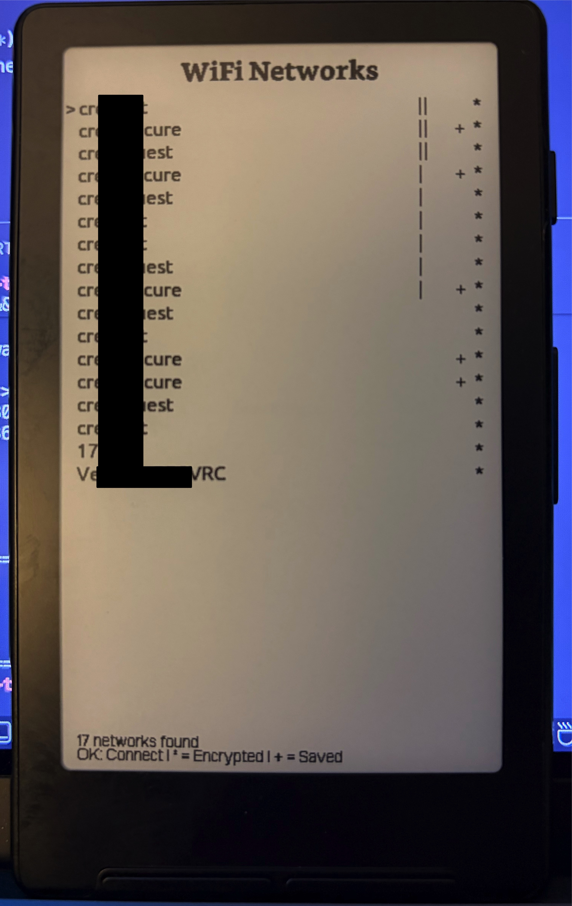
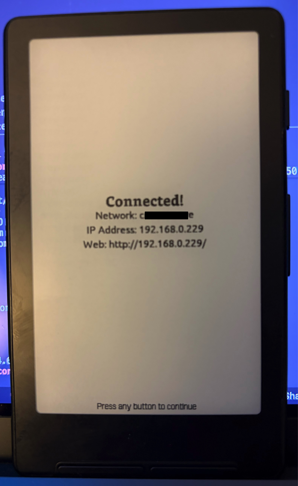
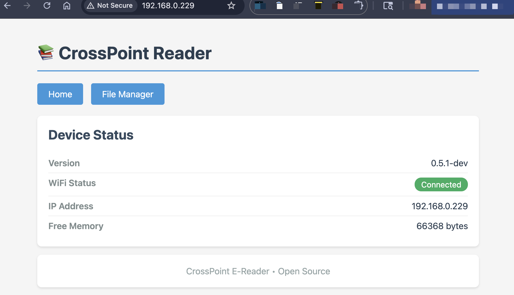
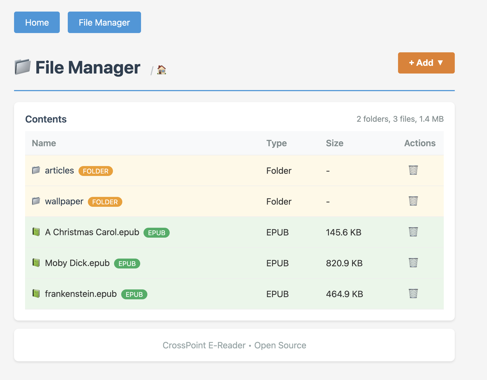
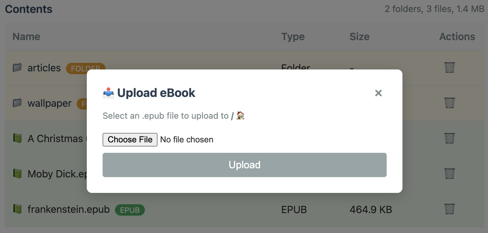

# Web Server Guide

This guide explains how to connect your Papyrix Reader to WiFi and use the built-in web server to upload books from your computer or phone.

## Overview

Papyrix Reader includes a built-in web server that allows you to:

- Upload books wirelessly from any device on the same WiFi network
- Browse and manage files on your device's SD card
- Create folders to organize your ebooks
- Delete files and folders
- Upload and manage custom sleep screen images

## Prerequisites

- Your Papyrix Reader device
- A WiFi network
- A computer, phone, or tablet connected to the **same WiFi network**

---

## Step 1: Accessing File Transfer

1. From the Home screen, press the **Left** button (or from the file browser, select **Sync**)
2. Select **File Transfer**
3. The device will automatically start scanning for available networks

---

## Step 2: Connecting to WiFi

### Viewing Available Networks

Once the scan completes, you'll see a list of available WiFi networks with the following indicators:

- **Signal strength bars** (`||||`, `|||`, `||`, `|`) - Shows connection quality
- **`*` symbol** - Indicates the network is password-protected (encrypted)
- **`+` symbol** - Indicates you have previously saved credentials for this network

### Selecting a Network

1. Use the **Left/Right** (or **Volume Up/Down**) buttons to navigate through the network list
2. Press **Confirm** to select the highlighted network

### Entering Password (for encrypted networks)

If the network requires a password:

1. An on-screen keyboard will appear with a full character grid
2. The keyboard is organized in zones:
   - **Rows 1-3:** Lowercase letters (a-z) and common symbols (. - _ @)
   - **Rows 4-6:** Uppercase letters (A-Z) and symbols (! # $ %)
   - **Row 7:** Numbers (0-9)
   - **Row 8:** Additional symbols (^ & * ( ) + [ ] \)
   - **Bottom row:** SPACE and BACKSPACE controls
3. Use **Up/Down/Left/Right** to navigate the grid
4. Press **Confirm** to enter the selected character
5. Press **Back** to cancel and return

**Note:** If you've previously connected to this network, the saved password will be used automatically.

### Connection Process

The device will display "Connecting..." while establishing the connection. This typically takes 5-10 seconds.

### Saving Credentials

If this is a new network, you'll be prompted to save the password:

- Select **Yes** to save credentials for automatic connection next time (NOTE: These are stored in plaintext on the device's SD card. Do not use this for sensitive networks.)
- Select **No** to connect without saving

---

## Step 3: Connection Success

Once connected, the screen will display:

- **Network name** (SSID)
- **IP Address** (e.g., `192.168.1.102`)
- **Web server URL** (e.g., `http://192.168.1.102/`)

**Important:** Make note of the IP address - you'll need this to access the web interface from your computer or phone.

---

## Step 4: Accessing the Web Interface

### From a Computer

1. Ensure your computer is connected to the **same WiFi network** as your Papyrix Reader
2. Open any web browser (Chrome is recommended)
3. Type the IP address shown on your device into the browser's address bar
   - Example: `http://192.168.1.102/`
4. Press Enter

### From a Phone or Tablet

1. Ensure your phone/tablet is connected to the **same WiFi network** as your Papyrix Reader
2. Open your mobile browser (Safari, Chrome, etc.)
3. Type the IP address into the address bar
   - Example: `http://192.168.1.102/`
4. Tap Go

---

## Step 5: Using the Web Interface

### Home Page

The home page displays:

- Device status and version information
- WiFi connection status
- Current IP address
- Available memory

Navigation links:

- **Home** - Returns to the status page
- **File Manager** - Access file management features
- **Sleep Screens** - Manage custom sleep screen images

### File Manager

Click **File Manager** to access file management features.

#### Browsing Files

- The file manager displays all files and folders on your SD card
- **Folders** are highlighted in yellow with a 📁 icon
- **EPUB files** are highlighted in green with a 📗 icon
- Click on a folder name to navigate into it
- Use the breadcrumb navigation at the top to go back to parent folders

#### Uploading Books

1. Click the **+ Add** button in the top-right corner
2. Select **Upload eBook** from the dropdown menu
3. Click **Choose File** and select a book file from your device
4. Click **Upload**
5. A progress bar will show the upload status
6. The page will automatically refresh when the upload is complete

**Supported book formats:** `.epub`, `.fb2`, `.xtc`, `.xtch`, `.xtg`, `.xth`, `.txt`, `.text`, `.md`, `.markdown`

**Supported image formats:** `.jpg`, `.jpeg`, `.png`, `.bmp`

**Note:** Files with uppercase extensions (e.g., `Book.EPUB`) are automatically normalized to lowercase on upload. Unsupported file types will be rejected.

#### Creating Folders

1. Click the **+ Add** button in the top-right corner
2. Select **New Folder** from the dropdown menu
3. Enter a folder name (letters, numbers, underscores, and hyphens only)
4. Click **Create Folder**

This is useful for organizing your ebooks by genre, author, or series.

#### Deleting Files and Folders

1. Click the **🗑️** (trash) icon next to any file or folder
2. Confirm the deletion in the popup dialog
3. Click **Delete** to permanently remove the item

**Warning:** Deletion is permanent and cannot be undone!

**Note:** Folders must be empty before they can be deleted.

### Sleep Screens

Click **Sleep Screens** to manage custom sleep screen images.

#### Viewing Sleep Screens

- The page displays all BMP images in the `/sleep` directory on the SD card
- Each image shows its filename and file size
- A summary at the top shows the total number of images and combined size

#### Uploading Sleep Screens

1. Click the **Upload** button in the top-right corner
2. Select a `.bmp` file from your device
3. Click **Upload**
4. A progress bar will show the upload status
5. The page will automatically refresh when the upload is complete

**Note:** Only `.bmp` files are accepted. Use the [sleep screen converter](../README.md) (`make sleep-screen`) to convert images to the correct format.

#### Deleting Sleep Screens

1. Click the **🗑️** (trash) icon next to any image
2. Confirm the deletion in the popup dialog
3. Click **Delete** to permanently remove the image

**Note:** Set the **Sleep Screen** setting to **Custom** on the device to use uploaded images. A random image will be shown each time the device sleeps. See the [User Guide](user_guide.md#37-sleep-screen) for more details.

---

## Troubleshooting

### Cannot See the Device on the Network

**Problem:** Browser shows "Cannot connect" or "Site can't be reached"

**Solutions:**

1. Verify both devices are on the **same WiFi network**
   - Check your computer/phone WiFi settings
   - Confirm the Papyrix Reader shows "Connected" status
2. Double-check the IP address
   - Make sure you typed it correctly
   - Include `http://` at the beginning
3. Try disabling VPN if you're using one
4. Some networks have "client isolation" enabled - check with your network administrator

### Connection Drops or Times Out

**Problem:** WiFi connection is unstable

**Solutions:**

1. Move closer to the WiFi router
2. Check signal strength on the device (should be at least `||` or better)
3. Avoid interference from other devices
4. Try a different WiFi network if available

### Upload Fails

**Problem:** File upload doesn't complete or shows an error

**Solutions:**

1. Ensure the file is a supported format (`.epub`, `.fb2`, `.txt`, `.md`, etc.)
2. Check that the SD card has enough free space
3. Try uploading a smaller file first to test
4. Refresh the browser page and try again

### Saved Password Not Working

**Problem:** Device fails to connect with saved credentials

**Solutions:**

1. When connection fails, you'll be prompted to "Forget Network"
2. Select **Yes** to remove the saved password
3. Reconnect and enter the password again
4. Choose to save the new password

---

## Security Notes

- The web server runs on port 80 (standard HTTP)
- **No authentication is required** - anyone on the same network can access the interface
- The web server is only accessible while the WiFi screen shows "Connected"
- The web server automatically stops when you exit the WiFi screen
- For security, only use on trusted private networks

---

## Technical Details

- **Supported WiFi:** 2.4GHz networks (802.11 b/g/n)
- **Web Server Port:** 80 (HTTP)
- **Maximum Upload Size:** Limited by available SD card space
- **Supported File Formats:** `.epub`, `.fb2`, `.xtc`, `.xtch`, `.xtg`, `.xth`, `.txt`, `.text`, `.md`, `.markdown` (books); `.jpg`, `.jpeg`, `.png`, `.bmp` (images)
- **Browser Compatibility:** All modern browsers (Chrome, Firefox, Safari, Edge)

---

## Tips and Best Practices

1. **Organize with folders** - Create folders before uploading to keep your library organized
2. **Check signal strength** - Stronger signals (`|||` or `||||`) provide faster, more reliable uploads
3. **Upload multiple files** - You can upload files one at a time; the page refreshes after each upload
4. **Use descriptive names** - Name your folders clearly (e.g., "SciFi", "Mystery", "Non-Fiction")
5. **Keep credentials saved** - Save your WiFi password for quick reconnection in the future
6. **Exit when done** - Press **Back** to exit the WiFi screen and save battery

---

## Exiting WiFi Mode

When you're finished uploading files:

1. Press the **Back** button on your Papyrix Reader
2. The web server will automatically stop
3. WiFi will disconnect
4. **The device will automatically restart** to reclaim memory

> **Note:** The automatic restart is required because the ESP32's WiFi stack fragments memory in a way that cannot be recovered. Without this restart, XTC books may fail to load with a "Memory error". The restart is quick and your uploaded files will be immediately available in the file browser.

---

## Related Documentation

- [User Guide](user_guide.md) - General device operation
- [Customization Guide](customization.md) - Custom themes and fonts
- [README](../README.md) - Project overview and features
